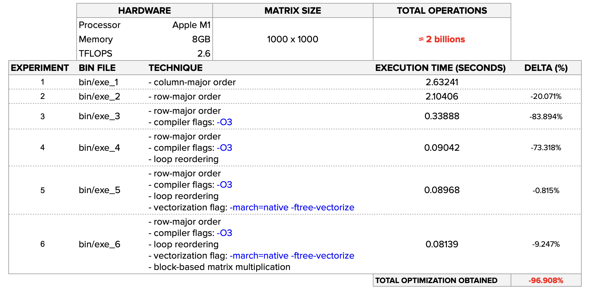

# 🚀 Matrix Multiplication Optimization in C

This repository provides optimized implementations of matrix multiplication algorithms in C, leveraging advanced techniques to achieve high performance. We explore methods like blocking, vectorization, and loop reordering to maximize matrix multiplication efficiency.

> ### 🌐 Related Fields of Study
> - **Algorithms**
> - **Computer Architecture**
> - **Data Processing**
> - **High-Performance Computing**
> - **Optimization**
> - **Parallel Computing**
---

## 🌟 Key Techniques

#### 🔹 1. Row-Major Order
Row-major order stores data row by row in memory. This technique ensures better spatial locality during row-wise traversals, reducing memory access times and improving overall performance.

#### 🔹 2. Loop Reordering
Loop reordering adjusts the order of nested loop iterations to optimize memory access patterns. This improves data locality and minimizes cache misses, making computations more efficient.

#### 🔹 3. Vectorization
Vectorization leverages SIMD (Single Instruction, Multiple Data) instructions to perform parallel computations, accelerating processing on supported hardware architectures.

#### 🔹 4. Blocking
Blocking breaks matrices into smaller sub-blocks to optimize memory hierarchy usage. This reduces cache misses and enhances performance by improving memory access patterns.

---
## 🏆 Outcomes Achieved

---

## 📂 Project Structure

- `src/`: Contains the C source code with optimized algorithm implementations.
- `bin/`: Contains the executables compiled from sources.

## 🛠️ Compilation Instructions

To compile the project, use a compiler like `gcc` with appropriate optimization flags for SIMD and other techniques:

### HOW TO COMPILE

1. `bin/exe_1`
    ```bash
    gcc -o bin/exe_1 src/mat_mul_1.c
2. `bin/exe_2`
    ```bash
    gcc -o bin/exe_2 src/mat_mul_2.c
3. `bin/exe_3`
    ```bash
    gcc -O3 -o bin/exe_3 src/mat_mul_2.c
4. `bin/exe_4`
    ```bash
    gcc -O3 -o bin/exe_4 src/mat_mul_3.c
5. `bin/exe_5`
    ```bash
    gcc -O3 -march=native -ftree-vectorize -o bin/exe_5 src/mat_mul_3.c
6. `bin/exe_6`
    ```bash
    gcc -O3 -march=native -ftree-vectorize -o bin/exe_6 src/mat_mul_4.c